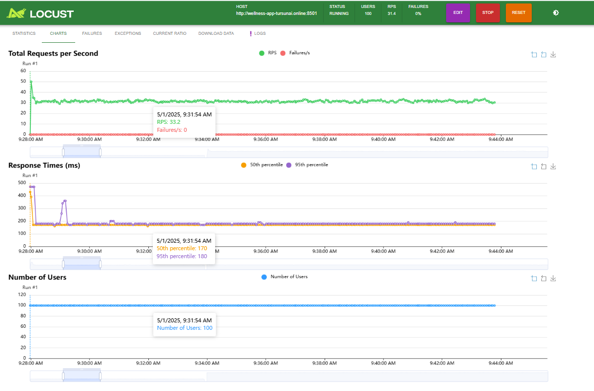
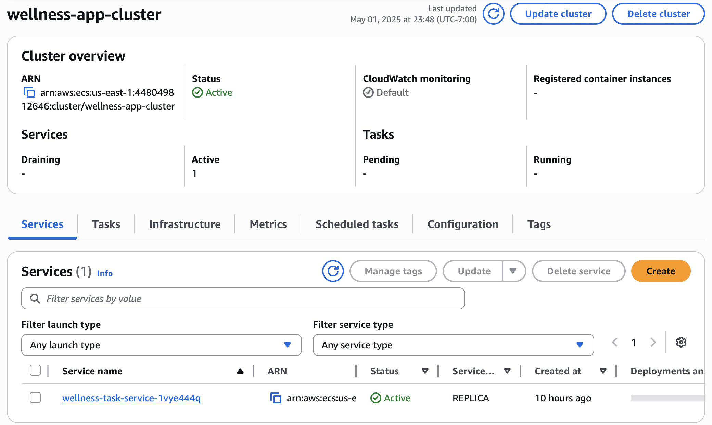
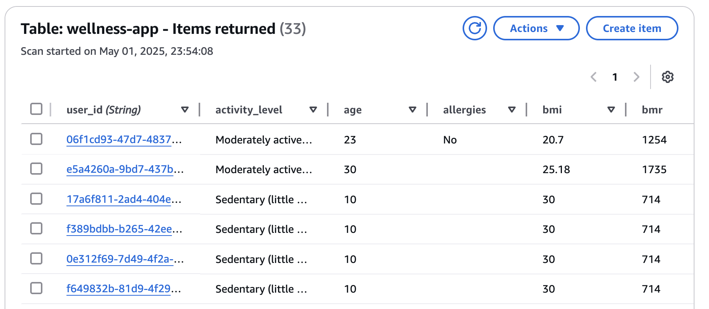
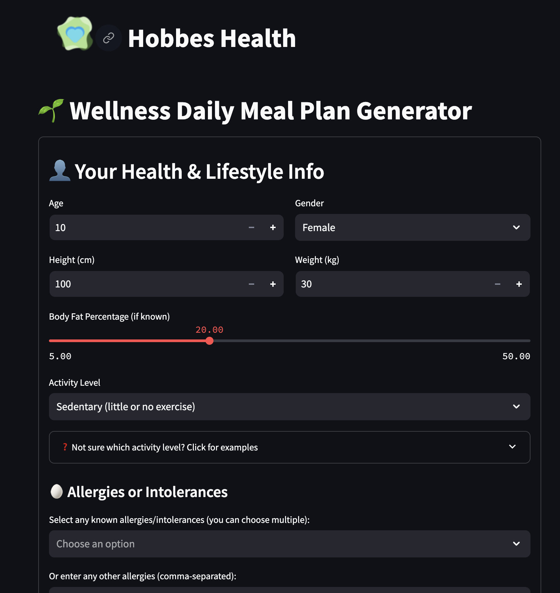
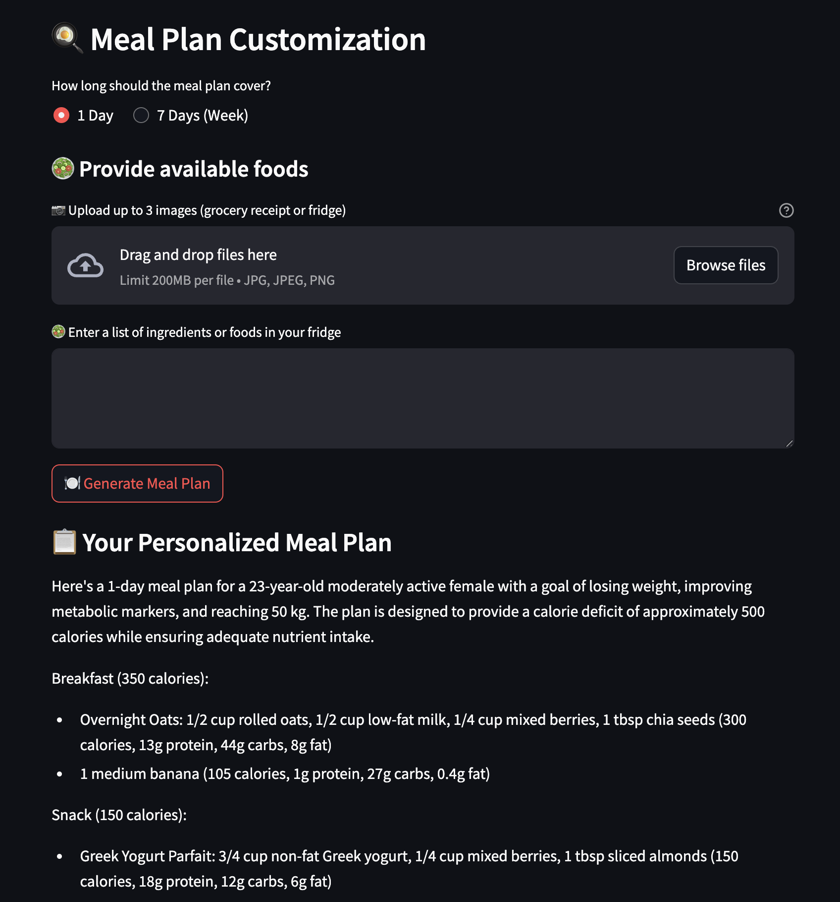
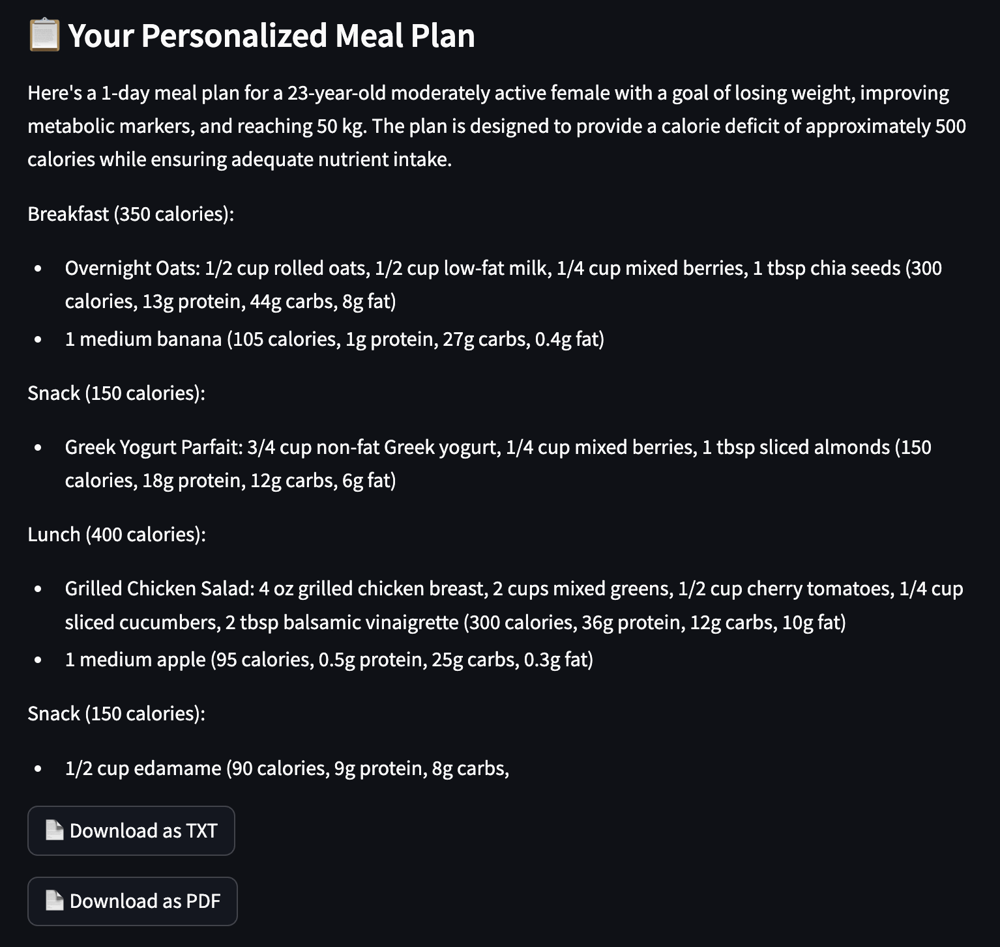
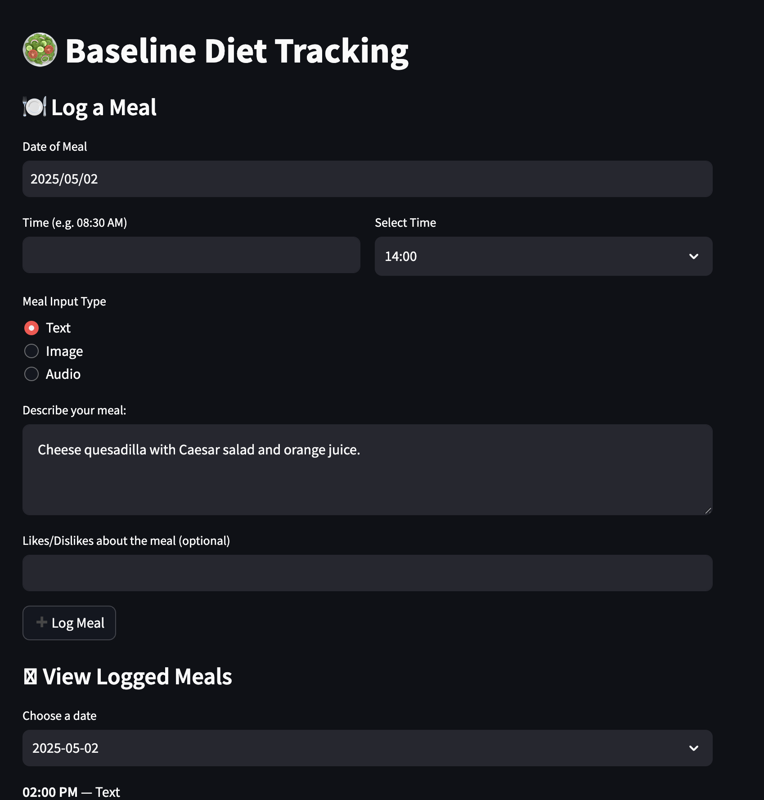
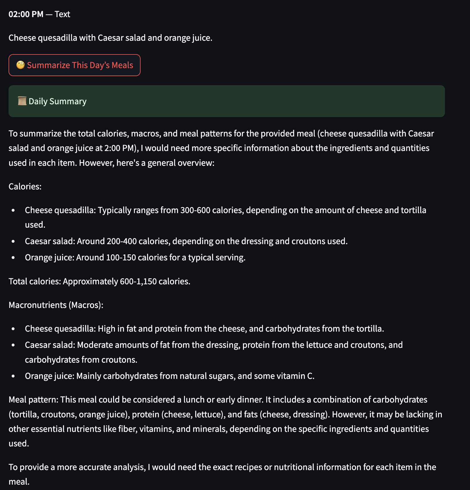

[](https://github.com/tursunait/wellness_app/actions/workflows/CICD.yaml)
# 🥗 Wellness Meal Plan Generator
## Authors
Tursunai Turumbekova, Afag Ramazanova

**Personalized Wellness App**  
A full-stack Streamlit web application that generates AI-personalized meal plans based on user profile, lifestyle, health goals, and available food items. Built with AWS integration, Claude AI (via Bedrock), and hosted on an EC2 instance with a custom domain.

## 🚀 Live Demo

🔗 [https://wellness-app-tursunai.online](http://wellness-app-tursunai.online:8501)
📺 [Demo Video](https://www.youtube.com/watch?v=C6csKAJZm18)

## 🧠 Claude Prompt Logic

Claude generates structured meal plans based on:
- User input: age, gender, weight, goals, equipment, ingredients
- Meal format: Day-by-day, breakfast/lunch/dinner/snacks
- Macronutrient output per meal (calories, protein, carbs, fat)

## 📌 Features

- 🧬 **Personalized User Profile Form** (age, gender, weight, height, goals, allergies, and more)
- 🧠 **Smart Meal Plan Generation** using Claude (Anthropic) via AWS Bedrock
- 🗓️ Generate meal plans for **1 Day or 7 Days**, with **calorie & macronutrient breakdown**
- 📸 Upload grocery/fridge images + type in available ingredients for better personalization
- 📝 **Diet tracking** section with DynamoDB-powered logging and daily nutrition summaries
- 📥 **Download meal plans** as PDF or TXT
- ☁️ **Hosted on AWS EC2** with a custom domain via Namecheap

## 🖥️ Tech Stack

| Layer         | Tools / Services Used                                  |
|---------------|--------------------------------------------------------|
| **Frontend**  | `Streamlit`, `PIL`, `HTML/CSS Markdown`               |
| **Backend**   | `Python`, `Claude AI via AWS Bedrock`, `uuid`, `boto3` |
| **Database**  | `Amazon DynamoDB`                                      |
| **Cloud**     | `AWS EC2`, `ECS Fargate`, `ECR`, `Bedrock`, `IAM`, `Route 53`, `Namecheap` |
| **Dev Tools** | `pip`, `venv`, `dotenv`, `GitHub Actions`, `Makefile`, `Locust`, `Docker` |
| **Containers**| `Docker`, `ECS Fargate`, `CloudWatch Logs`             |

---

## 📂 Project Structure

```
wellness_app/
├── main.py                        # Main Streamlit app
├── features/
│   ├── calculations.py           # BMI, BMR, TDEE logic
│   ├── llm_claude.py             # Claude AI prompt calling logic
│   ├── downloads.py              # TXT & PDF download functions
│   ├── dynamo.py                 # DynamoDB connection and storage
│   ├── diet_tracking.py          # Logging meals and daily summaries
│   └── history.py                # View meal plan generation history
├── requirements.txt
├── .env                          # AWS Keys, Region
├── Dockerfile
├── Makefile
├── locustfile.py
├── logs.txt
├── .github/workflows
│   └── CICD.yaml 
└── README.md
```

---

## 🔐 Environment Variables

Set up a `.env` file in the root directory:

```dotenv
AWS_ACCESS_KEY_ID=your_key_id
AWS_SECRET_ACCESS_KEY=your_secret
AWS_REGION=us-east-1
```

**Never commit your `.env` file to version control.**

---

## 📦 Installation & Local Setup

```bash
# 1. Clone the repo
git clone https://github.com/tursunait/wellness_app.git
cd wellness_app

# 2. Create a virtual environment
python3 -m venv venv
source venv/bin/activate

# 3. Install dependencies
pip install -r requirements.txt

# 4. Create and fill in the .env file (see above)

# 5. Run the app
streamlit run main.py
```

---

## 🌐 Deployment on AWS EC2

1. Launch EC2 instance (Ubuntu)
2. SSH into the server
3. Install Python 3.12, pip, and virtualenv
4. Clone this repo and follow local setup instructions
5. Run the app:
   ```bash
   nohup streamlit run main.py --server.port 8501 --server.address 0.0.0.0 &
   ```
6. Point your domain to EC2 IP (via A record in Namecheap)

## 🛠️ Docker Setup

🐳 Build and Run the Docker Container
```bash 
# Build the Docker image
docker build -t wellness-app .

# Run the container on port 8501
docker run -p 8501:8501 wellness-app

```

Here is the Docker Image: 


## 🧪 Load Testing with Locust
Run the locust file to test the load on the app.

```bash
locust -f locustfile.py
```

Here is the Locust file:


---

## 🚀 ECS Fargate Deployment (via CI/CD)

- GitHub Actions build & test code
- Push Docker image to Amazon ECR
- Auto-update ECS service for `wellness-task`
- Configured with `Makefile` + `.github/workflows/deploy.yml`

CI/CD YAML includes:
- ✅ Checkout
- ✅ Lint/Test
- ✅ Build Docker
- ✅ Push to ECR
- ✅ Deploy to ECS (Fargate)

Here is the ECS Fargate Deployment  file:


---

## 🗃️ Database: Amazon DynamoDB

The app stores user profiles and diet logs in **Amazon DynamoDB**, enabling persistent, scalable, and fast access to:

* User demographic and health profile data
* Daily meal plans and feedback logs
* Nutrition summaries and meal history




## Features:
🧬 **Personalized User Profile Form** 



🗓️ Generate meal plans for **1 Day or 7 Days**, with **calorie & macronutrient breakdown**

 

📥 **Download meal plans** as PDF or TXT

 

📝 **Diet tracking** section with DynamoDB-powered logging and daily nutrition summaries

 

 


## 📘 Future Improvements

- ✅ Add user authentication
- ✅ Display macronutrient totals per day
- 📈 Visualize nutrition progress in charts
- 💬 Add chatbot to answer nutrition questions
- 📱 Build a mobile-friendly interface
- 🧾 Integrate image-to-text parsing for groceries
- 📤 Enable email or SMS export of plans


## ✅ Requirements Met

- ✔️ **Open source ML model**: Claude (Anthropic) via AWS Bedrock used for meal generation
- ✔️ **Web service for inference**: Streamlit app hosted on AWS
- ✔️ **Containerized**: Dockerized application
- ✔️ **Deployed via orchestration**: ECS Fargate (Kubernetes-alternative)
- ✔️ **CI/CD pipeline**: GitHub Actions auto-build + deploy to ECS
- ✔️ **Monitoring**: ECS logging via CloudWatch
- ✔️ **Documentation & Demo**: [Live App](https://wellness-app-tursunai.online), screenshots below, and this README

## 🛡️ License

This project is licensed under the [MIT License](LICENSE).


